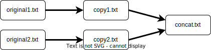
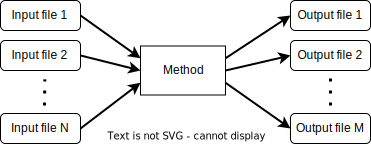
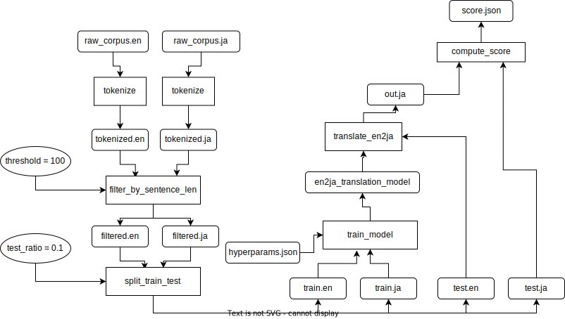
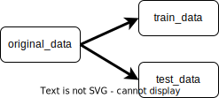

#################
JTCMake Tutorial
#################

JTCMake is an incremental build tool.
It shares the same basic concept as Makefile: in a process of creating multiple files with dependencies,

* it understands the dependencies and executes tasks in an appropriate order, and
* when we modify some files and re-build, it understands which files must be updated based on the files' modification time attribute (mtime), and updates those files only

Furthermore, JTCMake,

* leverages the expressiveness of Python
* ships with Windows
* supports content-hash-based update check in addition to mtime-based update check
* enables efficient management of a large number of files
  spanning a deep directory structure
* provides useful features such as a dependency graph visualizer
  and a rule selector

Although JTCMake was originally developed for data processing for machine learning on Jupyter Notebook,
it can also be used in standard Python script files and on the interactive interpreter for general build processes.

Since JTCMake is small and simple, we'll cover everything about it in this tutorial.

*******
Imports
*******

We assume that we have already imported the following items and thus the import directives may be omitted
in the sample codes in the later sections. ::

  from pathlib import Path

  from jtcmake import create_group, SELF
  import jtcmake as jtc

``create_group`` and ``SELF`` are the most frequently used components of JTCMake.

********
Overview
********

Typical workflow using JTCMake consists of three steps:

1. Create Group
2. Add rules
3. Make

Example: Writing to a file
===========================

Please think of a very simple task: writing "Hello!" to a file output/hello.txt.
For this task, we would write a Makefile below and execute ``$ make`` .

.. code-block:: Makefile

  outputs/hello.txt:
      mkdir -p $$(dirname $@)  # make directory for hello.txt
      echo "Hello!" > $@       # write to hello.txt

Its JTCMake counterpart looks like::
  
  def write_text(path: Path, text: str):
      path.write_text(text)

  # 1. Create Group
  g = create_group('output')

  # 2. Add rule(s)
  g.add('hello', 'hello.txt', write_text, SELF, 'Hello!')

  # 3. Make
  g.make()

In the above code, we

1. create a **Group** that we use as a container for the rules we will add later

   * The argument ``"output"`` will be used to prefix the paths of the Group's child elements

2. add a **rule** to the Group by ``Group.add()``

   * Its signature is ``Group.add(name, output_file, method, *args, **kwargs)``, meaning
     the name of the rule is ``name``, and ``output_file`` must be created by calling ``method(*args, **kwargs)``

   * In this case, we add a rule named "hello" which demands that a file ``output/hello.txt`` should be created
     by ``write_text(Path("output/hello.txt"), "Hello!")``

   * Note that JTCMake replaces ``SELF`` in args/kwargs by the target file path, in this case ``Path("output/hello.txt")``

3. execute ``make`` and JTCMake creates the file following the rule(s) defined in the Group

   * Note that the directory ``output/`` is automatically created by JTCMake so you don't need to
     write a code for it

You will see the following log after running ``g.make()``

------

.. raw:: html

  <html><head><meta charset="utf-8"><title>log</title></head><body><pre>Make hello
    write_text(
      path = <a href="output/hello.txt">PosixPath(&#x27;output/hello.txt&#x27;)</a>,
      text = &#x27;Hello!&#x27;,
    )
  </pre></body></html><html><head><meta charset="utf-8"><title>log</title></head><body><pre>Done hello
  </pre></body></html>

------

Please substitute ``WindowsPath`` for ``PosixPath`` if you are on Windows.
For those who are not familiar with Python's pathlib, ``pathlib.Path`` works as alias for
``pathlib.WindowsPath`` on Windows and ``pathlib.PosixPath`` on Linux and MacOS.
On Jupyter Notebook and Jupyter Lab, Paths are printed as HTML links so you can click them and jump to the files.

This example task is so simple that an incremental build tool does not seem very helpful.
It can be done by::

  Path('output/hello.txt').write_text('Hello!')

Example: Copying files
======================

Let's take a look at a slightly more complex task: coyping files.
It has three rules:

#. Create ``output/coyp1.txt`` by copying ``./original1.txt``
#. Create ``output/copy2.txt`` by copying ``./original2.txt``
#. Create ``output/concat.txt`` by concatenating ``output/copy1.txt`` and ``output/copy2.txt``

In this case, files have dependencies.

Makefile for this task would be

.. code-block:: Makefile

    output/coyp1.txt: original1.txt
        cp $< $@

    output/coyp2.txt: original2.txt
        cp $< $@

    output/concat.txt: output/copy1.txt output/copy2.txt
        cat $^ > $@

And the JTCMake equivalent is, ::

  import shutil

  def concat(destination, *sources):
      # write contents in the files `sources` into the file `destination`
      with open(destination, 'w') as f:
          for src in sources:
              f.write(src.read_text())
    
  # 1. Create the root Group with directory `output`
  g = create_group('output')

  # 2. Add rules to the Group
  g.add('cp1', 'copy1.txt', shutil.copy, jtc.File('original1.txt'), SELF)
  g.add('cp2', 'copy2.txt', shutil.copy, jtc.File('original2.txt'), SELF)
  g.add('concat', 'concat.txt', concat, SELF, g.cp1, g.cp2)

  # 3. Make
  g.make()

What is noteworthy here is that, after we add the rules "cp1" and "cp2",
we can refer to them by ``g.cp1`` and ``g.cp2``, respectively.

You will see what ``g.make()`` does from its log:

-------

.. raw:: html

  <html><head><meta charset="utf-8"><title>log</title></head><body><pre>Make cp1
    shutil.copy(
      src = <a href="original1.txt">PosixPath(&#x27;original1.txt&#x27;)</a>,
      dst = <a href="output/copy1.txt">PosixPath(&#x27;output/copy1.txt&#x27;)</a>,
      follow_symlinks = True,
    )
  </pre></body></html><html><head><meta charset="utf-8"><title>log</title></head><body><pre>Done cp1
  </pre></body></html><html><head><meta charset="utf-8"><title>log</title></head><body><pre>Make cp2
    shutil.copy(
      src = <a href="original2.txt">PosixPath(&#x27;original2.txt&#x27;)</a>,
      dst = <a href="output/copy2.txt">PosixPath(&#x27;output/copy2.txt&#x27;)</a>,
      follow_symlinks = True,
    )
  </pre></body></html><html><head><meta charset="utf-8"><title>log</title></head><body><pre>Done cp2
  </pre></body></html><html><head><meta charset="utf-8"><title>log</title></head><body><pre>Make concat
    concat(
      destination = <a href="output/concat.txt">PosixPath(&#x27;output/concat.txt&#x27;)</a>,
      sources = [<a href="output/copy1.txt">PosixPath(&#x27;output/copy1.txt&#x27;)</a>, <a href="output/copy2.txt">PosixPath(&#x27;output/copy2.txt&#x27;)</a>],
    )
  </pre></body></html><html><head><meta charset="utf-8"><title>log</title></head><body><pre>Done concat
  </pre></body></html>

-------

As can be seen from this log, JTCMake called the function ``concat`` with the arguments where
``SELF``,  ``g.cp1``, and ``g.cp2`` are replaced by
``Path("output/concat.txt")``, ``Path("output/copy1.txt")`` and ``Path("output/copy1.txt")``, respectively.
I hope this behavior is intuitive enough to you.

Re-run
------

Just like Makefile, JTCMake checks the existence and modification time of the input/output files before processing each rule.
If the output files exist and are newer than the input files, JTCMake skips the execution of the rule.
So running make again will do nothing. ::

  g.make()

Execution log will be:

---------

.. raw:: html

  <pre>Skip cp1</pre>
  <pre>Skip cp2</pre>
  <pre>Skip concat</pre>

---------

Update and re-run
-----------------

When you update a file and run ``g.make()`` again,
JTCMake re-creates the files that depends on the updated file. ::

  Path('original1.txt').touch()  # mtime of original1.txt is updated

  g.make()

As you see in the following log, rule "cp1" and "concat" were executed but "cp2" was skipped.

-----------------

.. raw:: html

  <html><head><meta charset="utf-8"><title>log</title></head><body><pre>Make cp1
    shutil.copy(
      src = <a href="original1.txt">PosixPath(&#x27;original1.txt&#x27;)</a>,
      dst = <a href="output/copy1.txt">PosixPath(&#x27;output/copy1.txt&#x27;)</a>,
      follow_symlinks = True,
    )
  </pre></body></html><html><head><meta charset="utf-8"><title>log</title></head><body><pre>Done cp1
  </pre></body></html><html><head><meta charset="utf-8"><title>log</title></head><body><pre>Skip cp2
  </pre></body></html><html><head><meta charset="utf-8"><title>log</title></head><body><pre>Make concat
    concat(
      destination = <a href="output/concat.txt">PosixPath(&#x27;output/concat.txt&#x27;)</a>,
      sources = [<a href="output/copy1.txt">PosixPath(&#x27;output/copy1.txt&#x27;)</a>, <a href="output/copy2.txt">PosixPath(&#x27;output/copy2.txt&#x27;)</a>],
    )
  </pre></body></html><html><head><meta charset="utf-8"><title>log</title></head><body><pre>Done concat
  </pre></body></html>

----------------

Summary
=======

JTCMake performs incremental build in the define-and-run manner.
Subsequent sections will describe the concepts and usage of JTCMake in detail.

***************
Adding Rules
***************

What a rule is
==============

Conceptually, a rule is a set of *input files*, *input Python objects*, *output files*, and a *method*
that creates the output files based on the content of the input files.
Note unlike Makefile JTCMake can treat Python objects as input values (with several considerations).

Combining such rules, we can create an acyclic directed bipartite graph of file/object nodes and method nodes.
We define the term "build procedure" as a series of file manipulations that can be modeled by this kind of graph,
and that is where you can take advantage of JTCMake.
Many tasks can be understood in that way. For example training and evaluation of a English-to-Japanese
machine translation model could be illustrated as follows.

Actual graph should be much more complex because we need to compare multiple models and compute variety of stats
of the dataset for analysis. Therefore, efficient management using a good build tool is important.

Note that the graph needs to be acyclic. File manupulation procedures containing loops, for example,
updating a file by appending some text to it, are out of scope.

Creating rules
==============

Before defining rules, we need to create a Group. We will place rules there. ::
  
  g = create_group("some_dir")

Groups provides grouping of rules not only on the Python code but also on the file system.
In this case, rules in this group will output files under the directory *./some_dir/*.
How groups are mapped to directory trees will be covered in the next chapter.

We can add rules into the Group using Group.add(). ::

  g.add("rule_name", "output.txt", some_func, arg1, arg2, kwarg1=foo, kwarg2=bar)

Its signature is ``add(name, [output_files], method, *args, **kwargs)`` .

:name: Name of the rule (str).
:output_files: Nested structure of output files (optional)
:method: Callable that will be basically called as ``method(*args, **kwargs)`` on update
:args/kwargs: Positional and keyword arguments that will be passed to ``method``.

We first assume that ``output_files`` is a plain single file, so we can call it ``output_file`` (without s).
Rules holding multiple output files will be explained later.

``method`` can be None. In that case, a decorator is returned.

Getting rule objects
====================

``Group.add()`` returns an object representing the added rule.
We can also get the rule object by ``group[name]`` or, if the name is a valid attribute string, by ``group.<name>``.  ::

  g = create_group("some_dir")

  rule = g.add("rule_name", "output.txt", some_func, arg1, arg2, kwarg1=foo, kwarg2=bar)

  assert rule is g.rule_name
  assert rule is g['rule_name']

It has an attribute ``path`` which is a pathlib.Path pointing to the output file. ::

  print(g.rule_name.path)  # prints ``PosixPath("some_dir/output")``

**Caution**
  ``rule.path`` being a relative path is not guaranteed.
  Although it gives a relative path in most cases under current implementation,
  it may be changed in the future so you must not rely on that behavior.

Type of output file
===================

``output_file`` can be an object that is an instance of str, os.PathLike, jtcmake.File, or jtcmake.VFile. ::

  g.add("rule1", "output1.txt", some_func, arg, kwarg=foo)             # OK
  g.add("rule2", Path("output2.txt"), some_func, arg, kwarg=foo)       # OK
  g.add("rule3", jtc.File("output3.txt"), some_func, arg, kwarg=foo)   # OK
  g.add("rule4", jtc.VFile("output4.txt"), some_func, arg, kwarg=foo)  # OK
  g.add("rule5", 0, some_func, arg, kwarg=foo)  # TypeError

When you pass a str or os.PathLike as ``output_file``, JTCMake internally converts it to jtcmake.File.
So the following are equivalent

  - ``g.add('rule_name', 'output.txt',           some_func, arg, kwarg=foo)``
  - ``g.add('rule_name', Path('output.txt'),     some_func, arg, kwarg=foo)``
  - ``g.add('rule_name', jtc.File('output.txt'), some_func, arg, kwarg=foo)``

Path prefixing and absolute path
================================

The output file path that you give will be prefixed by the parent Group's directory name. ::

  g = create_group('some_dir')
  g.add("rule", "output.txt", some_func, arg, kwarg=foo)  

  print(g.rule.path)  # prints Path("some_dir/output.txt"), not Path("./output.txt")

We can disable prefixing by giving an absolute path::

  g = create_group('some_dir')

  g.add("rule", "/abs/path/to/output.txt", some_func, arg, kwarg=foo)  

  print(g.rule.path)  # prints Path("/abs/path/to/output.txt")

Rule as an input to another rule
================================

You can pass a rule object as an argument to ``Group.add`` .
It makes the output file of the first rule an input file to the new rule. ::

  g = create_group("some_dir")

  g.add('rule1', 'output1.txt', some_func1)
  g.add('rule2', 'output2.txt', some_func2, foo, g.rule1, bar)

  g.make()

``some_func2`` will be called as ``some_func2(foo, Path("some_dir/output1.txt"), bar)`` .

Note:
  This explanation (and the following ones) are a little inaccurate.
  You will see how when we learn the **Auto-SELF** rule in the later section.

Rule objects in args/kwargs are replaced by the path of their output file.
This path replacement occurs inside the args/kwargs that has a deeply nested structure.
JTCMake searches for rule objects in args/kwargs by recursively checking the elements of tuples and lists, and the values of dicts.
For example, ::

  g = create_group("dir")
  g.add('rule', 'out', some_func, arg, kwarg=foo)

  g.add('rule1', 'out1', some_func, foo, (bar, g.rule))   # tuple
  g.add('rule2', 'out2', some_func, foo, [bar, g.rule])   # list
  g.add('rule3', 'out3', some_func, foo, {bar: g.rule})   # dict
  g.add('rule4', 'out4', some_func, [foo, {bar: (g.rule, baz)}])  # deeply nested structure

  g.make()

will execute ::

  some_func(foo, (bar, Path("dir/out")))
  some_func(foo, [bar, Path("dir/out")])
  some_func(foo, {bar: Path("dir/out")})
  some_func([foo, {bar: (Path("dir/out"), baz)}])

Though the behavior is simple and intuitive, there are some pitfalls around it.

1. JTCMake does not go deeper into container objects other than tuple, list, nor dict. ::

    g.add('rule', 'out', some_func, arg, kwarg=foo)

    # JTCMake does not look inside the set to find g.rule
    g.add('rule1', 'out1', some_func, {foo, g.rule})   

   rule1 will execute ``some_func({foo, g.rule})`` instead of ``some_func({foo, Path("dir/out")})`` which should not be what we want.

2. JTCMake does not check dict *keys*. It only checks *values* of dict

SELF
====

Now we know how to pass a rule's output file to another rule's method.
But how to pass a rule's output file to its own method?  ``jtcmake.SELF`` is for that. ::

  g = create_group("dir")

  g.add('rule', 'out', some_func, foo, SELF, a=bar)

  g.make()

will execute ``some_func(foo, Path("dir/out"), a=bar)``.
Here, ``SELF`` was replaced by ``Path("dir/out")`` .
JTCMake finds and replaces SELFs in args/kwargs of nested structure, just like it does for rule objects. ::

  g = create_group("dir")
  g.add('rule', 'out', some_func, [foo, {bar: (SELF, baz)}], a=SELF)

will execute ``some_func([foo, {bar: (Path("dir/out"), baz)}], a=Path("dir/out"))``.

Auto-SELF (Important)
=====================

If JTCMake has found no SELF in args/kwargs that you have provided, it adds a SELF
into the first position of the arguments. ::

  g = create_group("dir")
  g.add('rule', 'out', some_func, 'foo', a='bar')  # you gave no SELF

  # The above is equivalent to
  # g.add('rule', 'out', some_func, SELF, 'foo', a='bar')

  g.make()

will run ::

  some_func(Path("dir/out"), "foo", a="bar")

You cannot force JTCMake not to pass a SELF to the method.

Output file omission
====================

You can omit the argument ``output_file`` when it same as the name of the rule. ::
  
  g = create_group('some_dir')

  rule = g.add('a.txt', some_func, SELF)  # same as g.add('a.txt', 'a.txt', some_func, SELF)

  assert rule is g['a.txt']

Original files
==============

When building something, we often have "original files" that do not depend on any other files
and, therefore, are the start points of the build process.
We can bring those files into our definition of rules by wrapping them using ``jtcmake.File`` or ``jtcmake.VFile`` .
Actually we have already seen a case in the first chapter. Here I repost it. ::

  import shutil

  def concat(destination, *sources):
      # write contents in the files `sources` into the file `destination`
      with open(destination, 'w') as f:
          for src in sources:
              f.write(src.read_text())
    
  # 1. Create the root Group with directory `output`
  g = create_group('output')

  # 2. Add rules to the Group
  g.add('cp1', 'copy1.txt', shutil.copy, jtc.File('original1.txt'), SELF)
  g.add('cp2', 'copy2.txt', shutil.copy, jtc.File('original2.txt'), SELF)
  g.add('concat', 'concat.txt', concat, SELF, g.cp1, g.cp2)

  # 3. Make
  g.make()

will execute ::

  shutil.copy(Path("original1.txt"), Path("output/copy1.txt"))
  shutil.copy(Path("original2.txt"), Path("output/copy2.txt"))
  concat(Path("output/concat.txt"), Path("output/copy1.txt"), Path("output/copy2.txt"))

JTCMake replaces ``jtcmake.File`` and ``jtcmake.VFile`` in args/kwargs by corresponding pathlib.Path instances.
Difference of the two classes will be described in the **Memoization and Value Files** section.

Make a subset of rules
======================

By executing ``rule.make()`` you can make that rule and its dependencies only. ::

  g = create_group('dir')

  g.add('rule1', 'out1.txt', some_func1)
  g.add('rule2', 'out2.txt', some_func2)
  g.add('rule3', 'out3.txt', some_func3, g.rule2)  # depends on rule2

  g.rule3.make()

will run ::

  some_func2(Path("dir/out2.txt"))
  some_func3(Path("dir/out3.txt"), Path("dir/out2.txt"))

``jtcmake.make`` offers a way to make a subset of rules. ::

  jtcmake.make(rule1, rule2, rule5, rule10)

Specifying multiple output files
================================

So far, we have been dealing with rules that have only one output file.
However in practice, we often need rules that have multiple output files.
For example, we may need to split a file into two pieces.

In such cases, we can specify nested structure (hereafter **nest**) of output files instead of a single file like, ::

  g.add("original_data", "original.txt", download_data)
  g.add("rule", { "train": "train.csv", "test": "text.csv" }, split_train_test, g.original_data)
             #  ^^^^^^^^^^^^^^^^^^^^^^^^^^^^^^^^^^^^^^^^^^^^
             #  This is a nest of output files containing "train.csv" and "test.csv"

Nest of Output Files 
---------------------

Nest of output files is any data structure consisting of containers (tuple, list, or dict)
and leaf nodes (str, os.PathLike, jtcmake.File, or jtcmake.VFile).

Formally, "nest of output files" is recursively defined as follows:

- *str*, *os.PathLike*, *jtcmake.File*, *jtcmake.VFile* are nest of output files (we call them "atom")
- tuple/list whose elements are nest of output files is also nest of output files
- dict whose values are nest of output files is also nest of output files

This concept was imported from Tensorflow.

Examples
--------

Following objects are output file structure

- ``"foo/bar.txt"``
- ``Path("/tmp/file.txt")``
- ``jtc.File("./foo")``
- ``[ "foo", "bar" ]``
- ``[ jtc.File("foo"), { "a": Path("bar.exe"), 0: ("bar1.o", "bar2.o") } ]``

Following objects are not output file structure

- ``{ "foo.txt", "bar.txt" }`` *set* is not allowed
- ``[ "foo".txt", 0 ]`` int is not allowed

Internal Atom Normalization
----------------------------

Just like the single output file case, each atom in the nested output files undergo a two-step normalization.

Step 1: str and os.PathLike is converted to jtcmake.File

  For example, ::

    [ "foo.txt", Path("bar.txt"), jtcmake.VFile("/tmp/baz") ]

  is converted to ::

    [ jtcmake.File("foo.txt"), jtcmake.File("bar.txt" ), jtcmake.VFile("/tmp/baz") ]

Step 2: Path Prefixing

  Every atom (File or VFile) in the structure gets the parent Group's prefix string added to the front of its path
  if the path is not absolute

  For example, after you run the code below, ::

    g = create_group('root_dir')
    g.add('foo', ["foo1", "/tmp/foo"], some_method, SELF)

  Rule ``g.foo`` eventually holds a nest ::

    [ File("root_dir/foo1"), File("/tmp/foo") ]

Accessing Files of a Rule
-----------------------------

Now we know that a rule owns a nest of files.
We can access each file as if the rule itself is the nest.
That is, if the nest is an atom, the rule object itself acts as the output file.
For example, ::
  
  g = create_group('root_dir')
  g.add('foo', 'foo.txt', some_method, SELF)

Now ``g.foo`` represents the rule *foo* AND its output file "root_dir/foo.txt".
You can get its path::

  assert g.foo.path == pathlib.Path("root_dir/foo.txt")

and you can use it as an argument for another rule::
  
  g.add('bar', 'bar.txt', some_method, g.foo, SELF)

  # some_method(Path("root_dir/foo.txt"), Path("root_dir/bar.txt")) will be run

If the nest is not an atom but, for example, a tuple of two atoms, the rule object behaves as a tuple of two files::

  g = create_group('root_dir')
  g.add('foo', ('foo1.txt', 'foo2.txt'), some_method, SELF)

Now ``g.foo`` can be considered a tuple containing two files ::
  
  assert g.foo[0].path == pathlib.Path("root_dir/foo1.txt")
  assert g.foo[1].path == pathlib.Path("root_dir/foo2.txt")

or you can get paths at once::

  assert g.foo.path == (
                          pathlib.Path("root_dir/foo1.txt"),
                          pathlib.Path("root_dir/foo2.txt")
                       )

Following two are equivalent

- ``g.add('bar', 'bar.txt', some_method, SELF, g.foo)``
- ``g.add('bar', 'bar.txt', some_method, SELF, (g.foo[0], g.foo[1]))``

A rule holding an output file structures of dict behaves the same way except
you can access its elements via attributes::

  g = create_group('root_dir')
  g.add('foo', { 'a': 'foo1.txt' }, some_method, SELF)

  assert g.foo['a'] == g.foo.a

SELF for nest of output files
-----------------------------

When used for a class with multiple output files, SELF pretends to be the nest of the output files.

It's easier to understand SELF by examples.

Example 1.

  SELFs are replaced with their corresponding output file(s) ::

    g = create_group('root')

    # SELF can appear multiple times in args/kwargs
    g.add('foo', 'foo.txt', method1, 1, SELF, 2, a=SELF)  

    # SELF can point to whole output file structure
    g.add('bar', ('bar1.txt', 'bar2.txt'), method2, SELF)

    g.make()

  will call ::

    method1(1, Path("root/foo.txt"), 2, a=Path("root/foo.txt"))
    method2((Path("root/bar1.txt"), Path("root/bar2.txt"))
  
Example 2.

  args/kwargs containing SELF can be nested structures ::

    g = create_group('root')
    g.add('foo', 'foo.txt', method, [1, SELF], 2, bar={ 'a': SELF })
    g.make()

  will call ::

    method([1, Path("root/foo.txt")], 2, bar={ "a": Path("root/foo.txt") })
  

Example 3.

  You can get pointers to inner elements of the nest of output files by indexing SELF like ::

    g = create_group('root')

    # Getting a pointer to the 0-th element of the output file structure
    g.add('foo', [ 'foo.txt' ], method1, SELF[0])

    # Getting a pointer to element for key "a" of the output file structure
    g.add('bar', { 'a': 'bar.txt' }, method2, SELF['a'])

    # Attribute access is possible if the key is a valid python identifier
    g.add('baz', { 'a': 'baz.txt' }, method3, SELF.a)

    # Getting a pointers for an element in deep location
    g.add('x', { 'a': [ { 'a': [ 'x.txt' ] } ] }, method4, SELF.a[0].a)

    g.make()

  will call ::

    method1(Path("foo.txt"))
    method2(Path("bar.txt"))
    method3(Path("baz.txt"))
    method4([ Path("x.txt") ])
  

Precise Understanding of SELF (can be skipped)
++++++++++++++++++++++++++++++++++++++++++++++

You should have got how to use SELF from the above examples.
Here I give a more detailed explanation of SELF, which you don't have to understand.

- The type of SELF is *NestKey*, which is a type defined in JTCMake.

  - A NestKey object holds a tuple (x1, x2, ... x_N)
    
    - With this tuple, you can identify an item in a nested structure ``O`` by ``O[x1][x2]...[x_N]``
    - This is similar to how XPath identifies an element in XML.

  - Given a NestKey ``K`` holding a tuple (x1, x2, ... x_N),
    you can get a new NestKey holding a tuple (x1, x2, ... x_N, y) by ``K[y]``

- The tuple that SELF holds is () (0 element tuple). For a nest ``O``, it points to ``O`` it self.
- A NestKey in args/kwargs is considered to be pointing to an element in ``output_files`` of the rule
  - it will be replaced by that element before passed to the ``method``

Decorator-style add
===================

When you call Group.add with ``method`` being ``None``, it returns a decorator.
You can use this feature like ::

  g = create_group('root_dir')

  @g.add('x', 'x.txt', None, "hello!")
  def method(output_path, text):
      output_path.write_text(text)

This is equivalent to ::

  def method(output_path, text):
      output_path.write_text(text)

  g.add('x', 'x.txt', method, "hello!")

*******************************************
Group Tree Model and Path Prefixing
*******************************************

* Group tree is a data structure we use to organize rules.
* Rules are stored as leaf nodes of the tree.
* Basically, each Group node corresponds to a directory and each rule node corresponds to file(s).

Basic usage
===========

::

  # First create the root Group node by create_group(dirname)
  g = create_group('root_dir')

  # You can add child Group nodes by Group.add_group(group_name, dirname)
  g.add_group('dir1', 'dir1')
  g.add_group('dir2')  # You can omit dirname if group_name == dirname
  g.add_group('dir3', 'directory3')
  g.add_group('dir4/is/deep')  # You can specify deep dirname
  
  # Group tree can be arbitrarily deep
  g.dir1.add_group('deep')
  g.dir1.deep.add_group('deeper');

Now the Group tree implicitly has the following directory structure::

  root_dir/
  |--- dir1/
  |    `--- deep/
  |         `--- deeper/
  |--- dir2/
  |--- directory3/
  `--- dir4/is/deep/

Adding a rule node as a child of a Group node will place the rule's output file in the Group's directory. ::

  g = create_group('root_dir')
  g.add('rule', 'rule.txt', func, SELF)
  g.add_group('dir')
  g.dir.add('rule', 'rule.txt', func, SELF)
  
  # rule's output file name can include directories
  g.add('deep_rule', 'deep/rule.txt', func, SELF)

implies::

  root_dir/
  |--- rule.txt
  |--- dir/
  |    `--- rule.txt
  `--- deep/rule.txt

prefix vs dirname
=================

- Instead of specifying ``dirname`` in Group.add_group(), you can specify ``prefix``
- In fact, the following two are equivalent
  - ``Group.add_group(name, dirname)``
  - ``Group.add_group(name, prefix=dirname + '/')``

::

  g = create_group('root_dir')
  
  g.add_group('sub', prefix='pfx-')  # add Group with prefix='pfx-'
  g.sub.add('rule', 'rule.txt', func, SELF)  # cumulative prefix is 'root_dir/pfx-'
  
  g.sub.add_group('sub2', prefix='pfx2-')
  g.sub.sub2.add('rule', 'rule.txt', func, SELF)

implies::

  root_dir/
  |--- pfx-rule.txt
  `--- pfx-pfx2-rule.txt

Absolute Path
=============

When you give an absolute path to a Group or rule node, it won't be prefixed by its parent ::

  if os.name == 'nt':
      # for Windows
      g = create_group('root_dir')
      g.add_group('abs_group', 'C:\\Users\\sugi\\abs')  # Group node with absolute path
      g.abs_group.add('rule', 'rule.txt', func, SELF)
      g.add('abs_rule', 'C:\\Temp\\absolute.txt', func, SELF)  # rule node with absolute path
  else:
      # for Unix
      g = create_group('root_dir')
      g.add_group('abs_group', '/home/sugi/abs')  # Group node with absolute path
      g.abs_group.add('rule', 'rule.txt', func, SELF)
      g.add('abs_rule', '/tmp/absolute.txt', func, SELF)  # rule node with absolute path

is mapped to directory structure like ::

  root_dir/
  
  /home/sugi/abs/
  `--- rule.txt
  
  /tmp/absolute.txt

Accessing Group node as a dict
==============================

- You can get children of a Group node by group[name]
- This is useful when the name of a child node is not a valid Python identifier (e.g. "dir-1")

::

  g = create_group('root_dir')
  g.add_group('dir')
  g.dir.add('rule', func)
  
  assert g.dir == g['dir']
  assert g.dir.rule == g.dir['rule']

**********
Value File
**********

***************
Multi Threading
***************

*****************
Utility Functions
*****************

***************
Design Patterns
***************

.. rubric:: Footnotes

.. [#IFile] jtcmake.File and jtcmake.VFile are currently the only subclasses that implement
            the abstract class jtcmake.IFile.

